<p align="center">
  
  
  
  
  
  
</p>

<h1 align="center">🚌 TransitOps</h1>
<p align="center"><strong>Smart Transport Operations Platform</strong></p>
<p align="center">
  <em>Digitizing fleet operations — vehicle registry, driver management, trip dispatch,<br/>
  maintenance tracking, and fuel/expense analytics with server-enforced business rules.</em>
</p>

---

## 📐 System Architecture

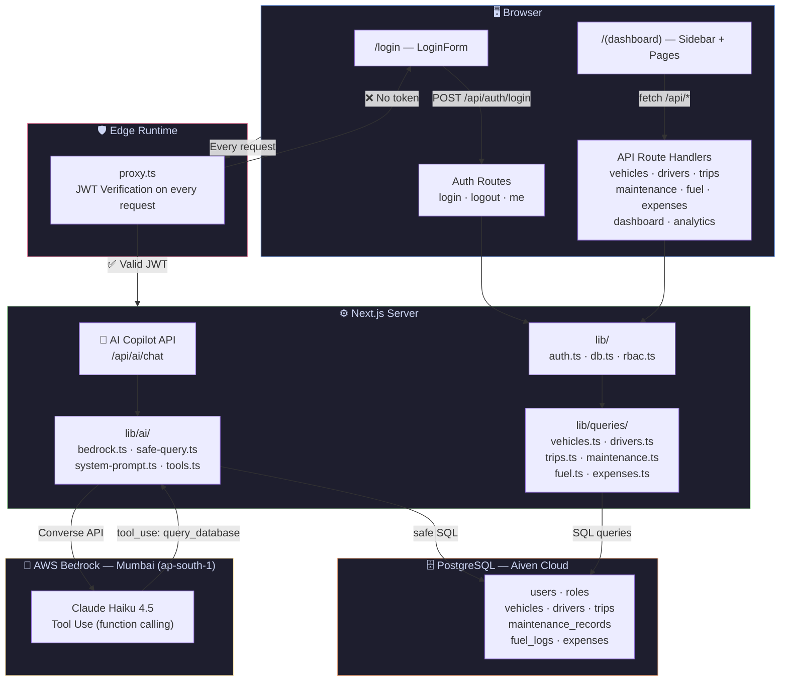

---

## 🔐 Authentication Flow

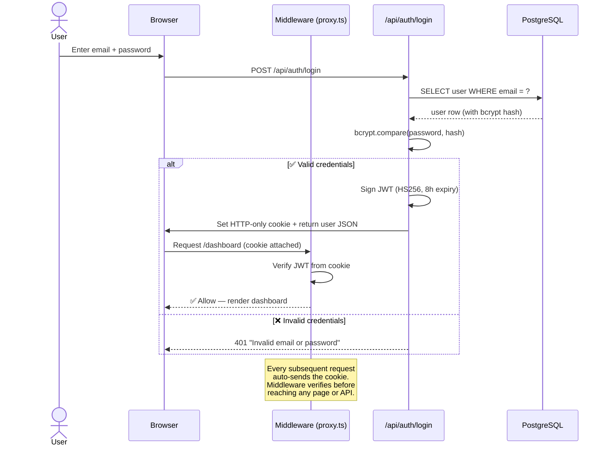

---

## 🛡️ Role-Based Access Control

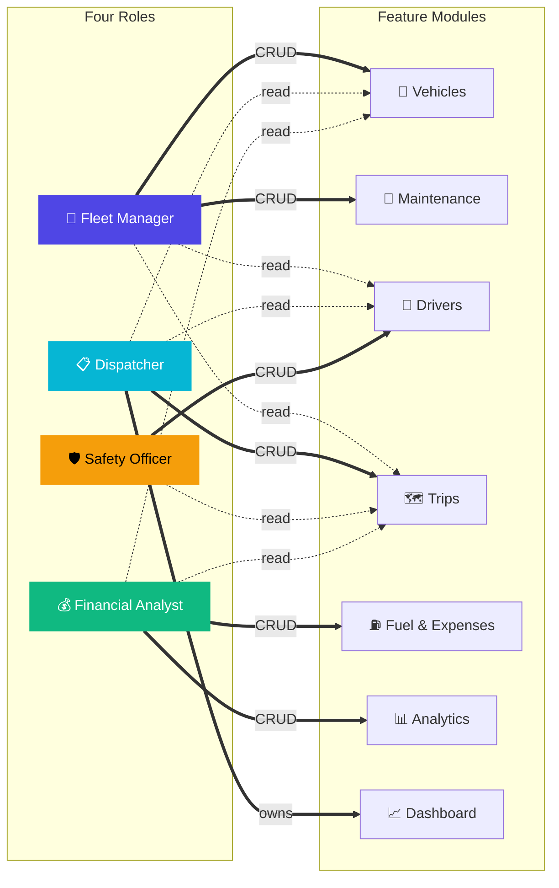

| Role | Owns (Full CRUD) | Read Access | Color |
|:---|:---|:---|:---:|
| **Fleet Manager** | Vehicles, Maintenance | Trips, Drivers | 🟣 |
| **Dispatcher** | Dashboard, Trips | Vehicles, Drivers | 🔵 |
| **Safety Officer** | Drivers, License Verification | Trips | 🟡 |
| **Financial Analyst** | Fuel, Expenses, Analytics | Trips, Vehicles | 🟢 |

---

## 🗄️ Entity-Relationship Diagram

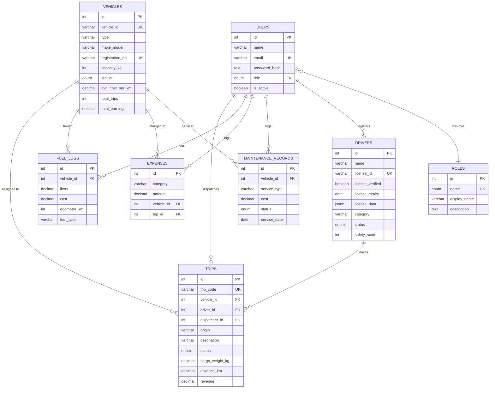

---

## ⚡ State Machines

### Vehicle Lifecycle

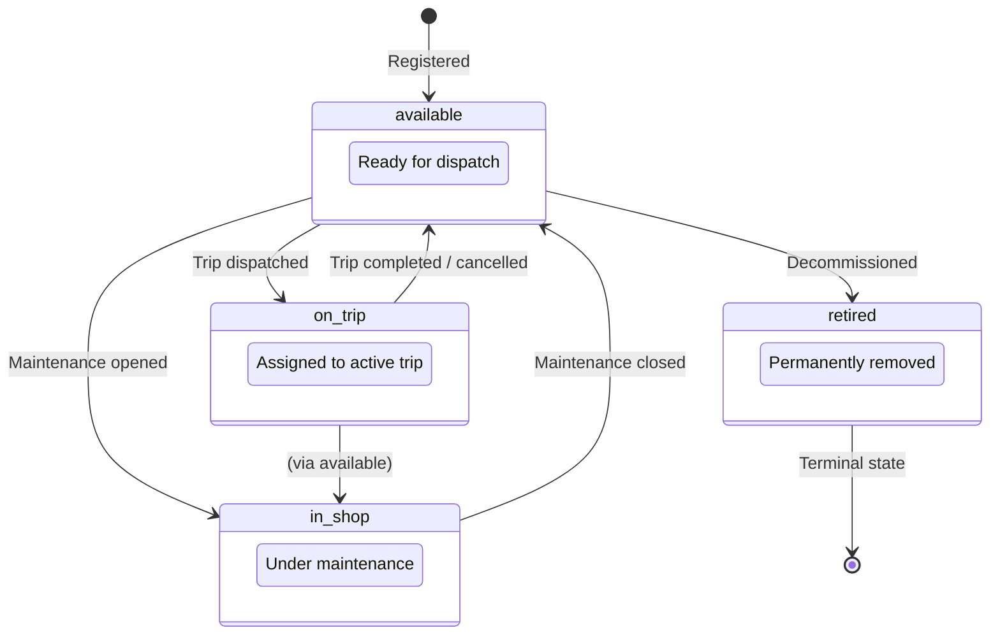

### Driver Lifecycle

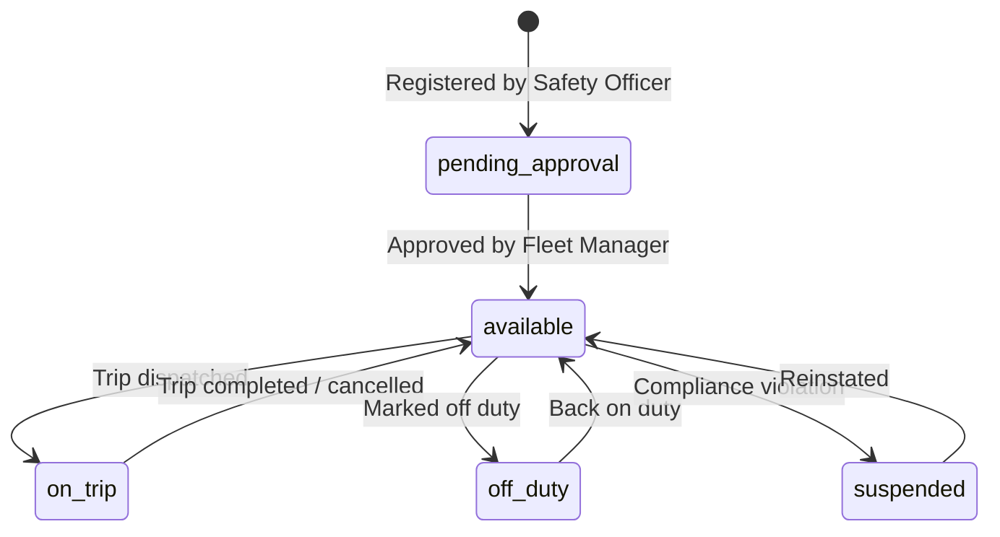

### Trip Lifecycle

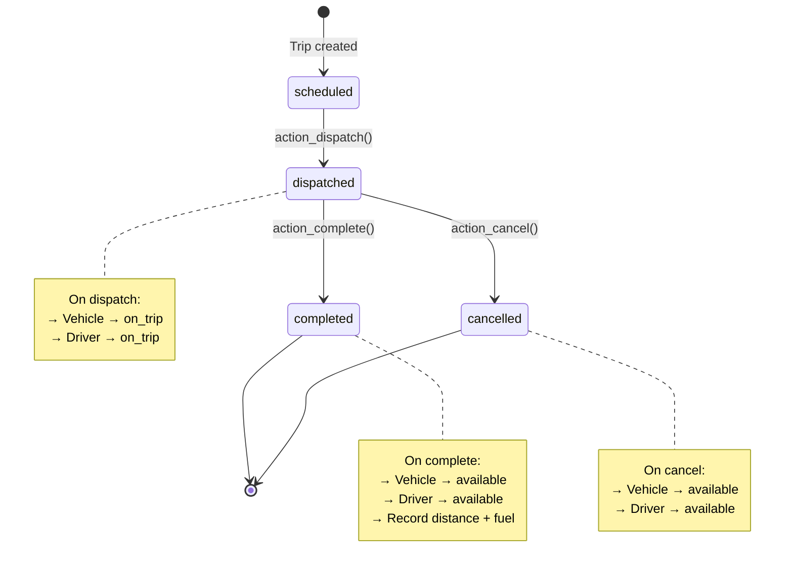

---

## 🔗 Cross-Model Trigger Map

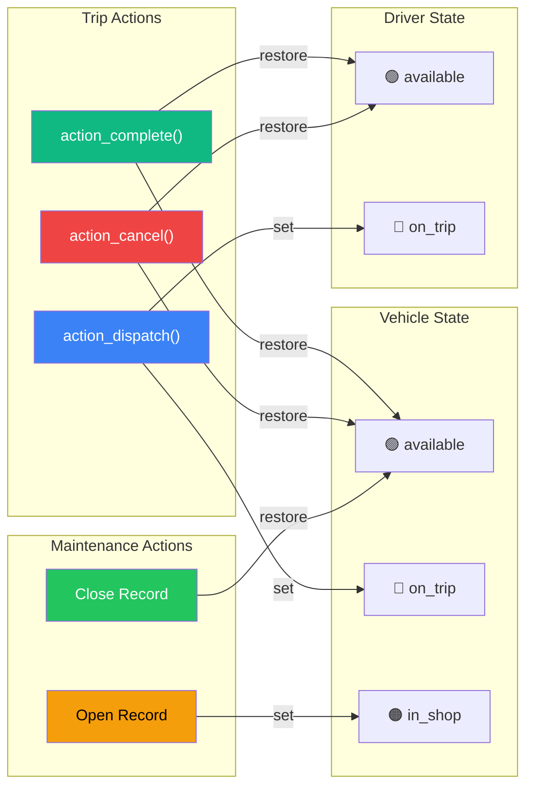

---

## 📱 Screen Wireframes

### Dashboard

```
┌─────────────────────────────────────────────────────────────────────┐
│  🚌 TransitOps     │  Dashboard                                    │
│  ─────────────────  │                                               │
│  ▦ Dashboard    ●   │  Welcome back, Riya · Dispatcher              │
│  🚌 Fleet          │                                               │
│  👤 Drivers         │  ┌──────────┐ ┌──────────┐ ┌──────────┐      │
│  🗺️ Trips          │  │ Active   │ │ Drivers  │ │ Trips    │      │
│  🔧 Maintenance    │  │ Vehicles │ │ On Trip  │ │ Today    │      │
│  ⛽ Fuel & Exp.    │  │    5     │ │    2     │ │    3     │      │
│  📊 Analytics      │  └──────────┘ └──────────┘ └──────────┘      │
│                     │  ┌──────────┐ ┌──────────┐ ┌──────────┐      │
│                     │  │ Pending  │ │ Revenue  │ │ Fleet    │      │
│                     │  │ Maint.   │ │ (Month)  │ │ Util. %  │      │
│  ┌───────────────┐  │  │    2     │ │ ₹2.4L    │ │   40%    │      │
│  │ 👤 Riya       │  │  └──────────┘ └──────────┘ └──────────┘      │
│  │   Dispatcher  │  │                                               │
│  └───────────────┘  │  ┌─────────────────────────────────────────┐  │
│  [↪ Sign out]       │  │  📊 Charts · 📈 Trends · 📋 Recent    │  │
│                     │  └─────────────────────────────────────────┘  │
└─────────────────────┴───────────────────────────────────────────────┘
```

### Fleet / Vehicles Page

```
┌─────────────────────────────────────────────────────────────────────┐
│  Sidebar  │  Fleet Registry                    [+ Add Vehicle]      │
│           │                                                         │
│           │  🔍 Search...   Filter: [All ▾]  [All Status ▾]        │
│           │                                                         │
│           │  ┌───────────────────────────────────────────────────┐  │
│           │  │ ID       │ Model          │ Type │ Cap.  │ Status│  │
│           │  ├──────────┼────────────────┼──────┼───────┼───────┤  │
│           │  │ VAN-09   │ Tata Ace Gold  │ Van  │ 800kg │🟢 Avl│  │
│           │  │ TRUCK-16 │ Ashok Leyland  │Truck │5000kg │🔵 OT │  │
│           │  │ BUS-03   │ Tata Starbus   │ Bus  │2000kg │🟢 Avl│  │
│           │  │ VAN-12   │ Mahindra Supro │ Van  │ 900kg │🟠 IS │  │
│           │  │ TRUCK-21 │ BharatBenz     │Truck │8000kg │🟢 Avl│  │
│           │  └───────────────────────────────────────────────────┘  │
│           │  Showing 5 vehicles · 3 Available · 1 On Trip · 1 Shop │
└───────────┴─────────────────────────────────────────────────────────┘
```

### Trip Management Page

```
┌─────────────────────────────────────────────────────────────────────┐
│  Sidebar  │  Trip Management                   [+ Create Trip]      │
│           │                                                         │
│           │  ┌───────────────────────────────────────────────────┐  │
│           │  │ Code   │ Route               │ Cargo │  Status   │  │
│           │  ├────────┼─────────────────────┼───────┼───────────┤  │
│           │  │TRP-001 │ Mumbai → Pune       │ 650kg │✅ Complete│  │
│           │  │TRP-002 │ Delhi → Jaipur      │4200kg │🔵 On Trip│  │
│           │  │TRP-003 │ Bengaluru → Chennai │1800kg │⏳ Schedul│  │
│           │  │TRP-005 │ Ahmedabad → Surat   │7500kg │📤 Dispatc│  │
│           │  └───────────────────────────────────────────────────┘  │
│           │                                                         │
│           │  Trip Detail: TRP-005                                   │
│           │  ┌─────────────────────────────────────────────────┐    │
│           │  │ Vehicle: TRUCK-21    Driver: Manish Tiwari      │    │
│           │  │ Cargo: 7500 / 8000 kg   Revenue: ₹72,000       │    │
│           │  │                                                  │    │
│           │  │ [✅ Complete Trip]  [❌ Cancel Trip]             │    │
│           │  └─────────────────────────────────────────────────┘    │
└───────────┴─────────────────────────────────────────────────────────┘
```

---

## 🤖 AI Ops Copilot — Powered by AWS Bedrock

A natural-language chat sidebar that queries the **live PostgreSQL database** in real-time. Users ask questions in plain English — the AI writes SQL, executes it safely, and responds with formatted insights.

### How It Works

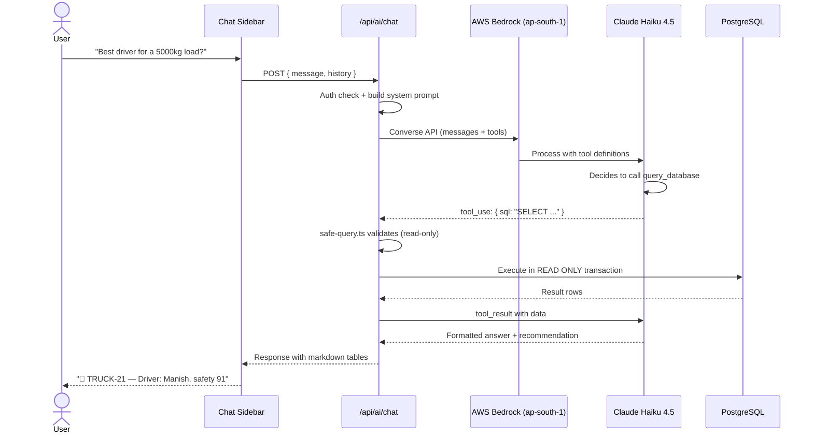

### Key Features

| Feature | Detail |
|---|---|
| **Natural Language → SQL** | Claude generates accurate SQL from plain English questions |
| **Read-Only Safety Layer** | `safe-query.ts` blocks INSERT/UPDATE/DELETE/DROP — only SELECT allowed |
| **Role-Aware** | System prompt adapts to user's role — dispatchers get trip-focused answers, analysts get cost-focused |
| **Live Database** | Queries real data, not mock data. Numbers are always current |
| **Markdown Tables** | Responses render with formatted tables, bold text, and recommendations |
| **Multi-Turn Context** | Maintains conversation history for follow-up questions |

### Example Conversations

**Dispatcher asks:**
> "Available vehicles for a 4000kg shipment?"

**AI responds:**
> Based on available vehicles with sufficient capacity:
>
> | Vehicle | Model | Capacity | Status | Cost/km |
> |---|---|---|---|---|
> | TRUCK-21 | BharatBenz 3528R | 8000kg | 🟢 Available | ₹14.50 |
> | BUS-03 | Tata Starbus | 2000kg | 🟢 Available | ❌ Under capacity |
>
> **🥇 Recommended: TRUCK-21** — 50% capacity utilization at 4000kg, lowest operating cost.

**Financial Analyst asks:**
> "Which vehicle has the highest fuel cost?"

**AI responds with a live query from fuel_logs, ranked by total cost.**

### Safety Architecture

```mermaid
graph LR
    Q["User Question"] --> CL["Claude Haiku 4.5"]
    CL -->|"tool_use"| SQ["safe-query.ts"]

    subgraph Validation["🛡️ SQL Safety Layer"]
        V1["✅ Starts with SELECT/WITH"]
        V2["❌ Blocks INSERT, UPDATE, DELETE"]
        V3["❌ Blocks DROP, ALTER, TRUNCATE"]
        V4["❌ Blocks password_hash access"]
        V5["✅ Adds LIMIT 50 if missing"]
        V6["✅ 5-second query timeout"]
        V7["✅ READ ONLY transaction"]
    end

    SQ --> Validation
    Validation -->|"Safe"| DB[("PostgreSQL")]
    Validation -->|"Blocked"| ERR["Error returned to Claude"]

    style Validation fill:#1e1e2e,stroke:#ef4444,color:#cdd6f4
```

### UI Wireframe

```
┌──────────────────────────────────┬──────────────────────┐
│  [Current Dashboard Page]        │  🤖 AI Copilot    ✕  │
│                                  │                      │
│                                  │  ┌────────────────┐  │
│                                  │  │ 🤖 Hi, Piyush! │  │
│                                  │  │ I can query     │  │
│                                  │  │ your live fleet │  │
│                                  │  │ database.       │  │
│                                  │  └────────────────┘  │
│                                  │                      │
│                                  │  Try asking:         │
│                                  │  ┌────────────────┐  │
│                                  │  │🚗 Fleet status  │  │
│                                  │  │   overview      │  │
│                                  │  ├────────────────┤  │
│                                  │  │👤 Best driver   │  │
│                                  │  │   for 3000kg    │  │
│                                  │  ├────────────────┤  │
│                                  │  │⛽ Fuel spend    │  │
│                                  │  │   this week     │  │
│                                  │  └────────────────┘  │
│                                  │                      │
│                                  │  ┌──────────┐ ┌───┐  │
│                                  │  │ Ask me...│ │ ➤ │  │
│                                  │  └──────────┘ └───┘  │
└──────────────────────────────────┴──────────────────────┘
```

---

## ✅ Build Progress

```mermaid
gantt
    title TransitOps Development Phases
    dateFormat X
    axisFormat %s

    section Phase 1 — Foundation ✅
    DB Schema + Seed Data          :done, p1a, 0, 1
    JWT Auth (sign/verify/cookie)  :done, p1b, 0, 1
    RBAC Permission Matrix         :done, p1c, 0, 1
    Edge Middleware (proxy.ts)     :done, p1d, 0, 1
    Login/Logout/Me API Routes     :done, p1e, 0, 1
    Login Page + LoginForm UI      :done, p1f, 0, 1
    Sidebar + StatusBadge          :done, p1g, 0, 1
    Dashboard Shell                :done, p1h, 0, 1
    Vehicles Queries + API         :done, p1i, 0, 1

    section AI Copilot ✅
    Bedrock Client + Converse API  :done, ai1, 1, 2
    System Prompt + Schema Context :done, ai2, 1, 2
    SQL Safety Layer               :done, ai3, 1, 2
    Chat API Route                 :done, ai4, 1, 2
    Chat Sidebar UI + Streaming    :done, ai5, 1, 2
    Role-Based Suggestions         :done, ai6, 1, 2

    section Phase 2 — CRUD Pages 🔄
    Fleet Page (list/create/edit)  :active, p2a, 2, 3
    Drivers Queries + API          :p2b, 2, 3
    Drivers Page                   :p2c, 2, 3
    Maintenance Queries + API      :p2d, 2, 3
    Maintenance Page               :p2e, 2, 3

    section Phase 3 — Trip Engine 🔜
    Trip Queries + Business Rules  :p3a, 3, 4
    Trip API (dispatch/complete/cancel) :p3b, 3, 4
    Trips Page + Action Buttons    :p3c, 3, 4

    section Phase 4 — Finance & Reports 🔜
    Fuel + Expense API + Page      :p4a, 4, 5
    Dashboard KPIs (live data)     :p4b, 4, 5
    Analytics + Charts             :p4c, 4, 5
    CSV Export                     :p4d, 4, 5
```

### Checklist

- [x] PostgreSQL schema — 8 tables, ENUMs, indexes, 555-line seed
- [x] JWT auth — `jose` HS256, HTTP-only cookies, 8h sessions
- [x] RBAC — 4 roles, 15 permissions, `requireRole()` + `canDo()`
- [x] Edge middleware — protects all dashboard + API routes
- [x] Auth APIs — `login` · `logout` · `me`
- [x] Login page — full-styled `LoginForm` component
- [x] Dashboard layout — `Sidebar` (role-filtered) + content shell
- [x] `StatusBadge` — color-coded state pills
- [x] Vehicle queries — `getAllVehicles`, `createVehicle`, `updateVehicle`, `deleteVehicle`
- [x] Vehicles API — `GET/POST /api/vehicles` · `GET/PUT/DELETE /api/vehicles/[id]`
- [x] **AI Copilot** — Bedrock client, system prompt, SQL safety layer, chat API
- [x] **AI Chat UI** — sidebar panel, message bubbles, markdown rendering, role-based suggestions
- [ ] Fleet page — list view + create/edit modal
- [ ] Drivers — queries + API + page
- [ ] Trips — queries + API + page with action buttons
- [ ] Maintenance — queries + API + page
- [ ] Fuel & Expenses — queries + API + page
- [ ] Dashboard KPIs — `/api/dashboard` live aggregates
- [ ] Analytics — charts + CSV export

---

## 🏢 Business Rules

All 10 rules enforced **server-side** — no rule relies on UI filtering alone.

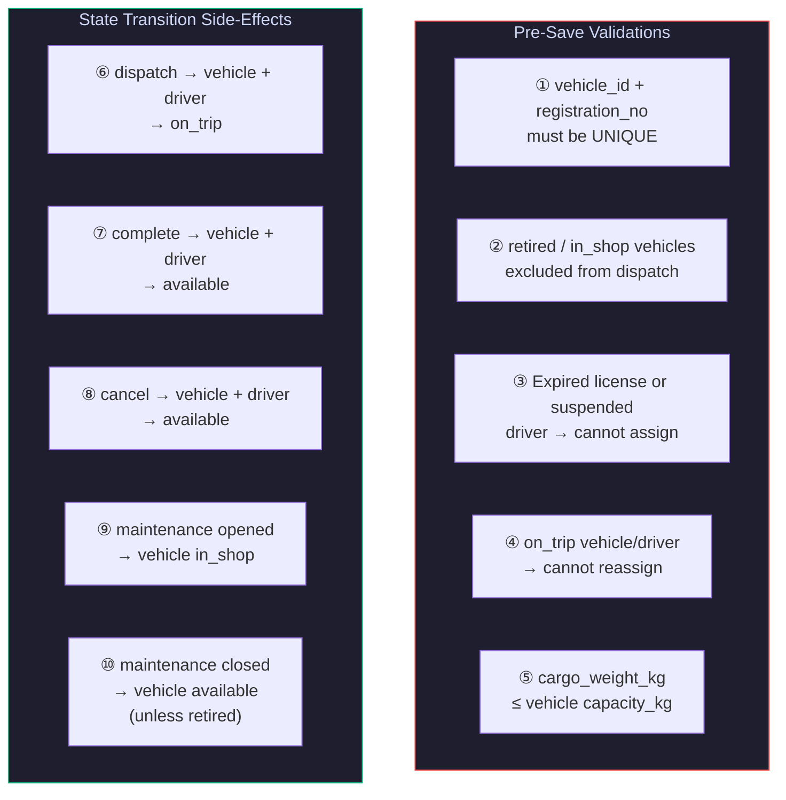

---

## 📊 KPI Formulas

| Metric | Formula | Used In |
|:---|:---|:---|
| **Fuel Efficiency** | `total_distance ÷ total_fuel_consumed` | Analytics |
| **Fleet Utilisation** | `vehicles_on_trip ÷ total_active_vehicles × 100` | Dashboard |
| **Operational Cost** | `fuel_cost + maintenance_cost` (per vehicle) | Analytics |
| **Vehicle ROI** | `(revenue − (maintenance + fuel)) ÷ acquisition_cost` | Analytics |

---

## 🚀 Quick Start

### Prerequisites


### 1. Clone & Install

```bash
git clone https://github.com/negimox/moveops.git
cd moveops
npm install
```

### 2. Configure Environment

```bash
# .example.env already has all shared team credentials pre-filled.
# Just copy it — no editing needed.
cp .example.env .env.local
```

> [!NOTE]
> The `.example.env` file contains the shared team database (Aiven Cloud) and AWS Bedrock credentials. All teammates can use the same file as-is.

### 3. Initialize Database

```bash
# Via psql:
psql $DATABASE_URL -f scripts/db-setup.sql

# Or via Node.js (if psql not available):
node scripts/verify-db.js
```

### 4. Run Dev Server

```bash
npm run dev
```

Open **http://localhost:3000**

### Demo Credentials

| Role | Email | Password |
|:---|:---|:---|
| 🟣 Fleet Manager | `fleet@transitops.in` | `Password@123` |
| 🔵 Dispatcher | `dispatch@transitops.in` | `Password@123` |
| 🟡 Safety Officer | `safety@transitops.in` | `Password@123` |
| 🟢 Financial Analyst | `finance@transitops.in` | `Password@123` |

---

## 📁 Project Structure

```
moveops/
│
├── app/
│   ├── (auth)/                    ← Public pages (no login required)
│   │   ├── layout.tsx
│   │   └── login/page.tsx
│   │
│   ├── (dashboard)/               ← Protected pages (login required)
│   │   ├── layout.tsx             ← Sidebar shell
│   │   ├── dashboard/page.tsx     ← KPI dashboard
│   │   ├── fleet/                 ← 🔄 Phase 2
│   │   ├── drivers/               ← 🔄 Phase 2
│   │   ├── trips/                 ← 🔜 Phase 3
│   │   ├── maintenance/           ← 🔄 Phase 2
│   │   ├── fuel-expenses/         ← 🔜 Phase 4
│   │   └── analytics/             ← 🔜 Phase 4
│   │
│   ├── api/                       ← Backend route handlers
│   │   ├── auth/                  ← ✅ login · logout · me
│   │   ├── vehicles/              ← ✅ list · create · get · update · delete
│   │   └── ai/chat/route.ts       ← ✅ AI Copilot API endpoint
│   │
│   ├── globals.css                ← Design tokens & theme + AI animations
│   ├── layout.tsx                 ← Root layout
│   └── page.tsx                   ← Landing redirect
│
├── components/
│   ├── auth/LoginForm.tsx         ← ✅ Styled login form
│   ├── ai/                        ← ✅ AI Copilot UI
│   │   ├── AICopilot.tsx          ← Floating sidebar panel
│   │   ├── ChatMessage.tsx        ← Message bubbles + markdown
│   │   └── SuggestedQuestions.tsx  ← Role-based starter prompts
│   └── ui/
│       ├── Sidebar.tsx            ← ✅ Role-aware navigation
│       └── StatusBadge.tsx        ← ✅ Color-coded status pills
│
├── lib/
│   ├── auth.ts                    ← ✅ JWT sign/verify + cookies
│   ├── db.ts                      ← ✅ PostgreSQL pool
│   ├── rbac.ts                    ← ✅ Permission matrix
│   ├── ai/                        ← ✅ AI Engine
│   │   ├── bedrock.ts             ← Bedrock Converse API client
│   │   ├── system-prompt.ts       ← Schema-aware prompt builder
│   │   ├── tools.ts               ← Tool definitions for Claude
│   │   └── safe-query.ts          ← SQL validator + read-only executor
│   └── queries/
│       └── vehicles.ts            ← ✅ Vehicle CRUD queries
│
├── scripts/
│   └── db-setup.sql               ← ✅ Full schema + seed (555 lines)
│
├── proxy.ts                       ← ✅ Edge middleware (auth guard)
├── .example.env                   ← Environment variable template
└── package.json
```

---

## 🧪 Acceptance Test

> Must pass before submission

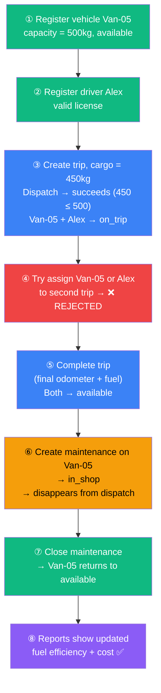

---

## 🛠️ Tech Stack

| Layer | Technology | Why |
|:---|:---|:---|
| **Framework** | Next.js 16 (App Router) | Full-stack in one project |
| **Language** | TypeScript 5 | Type safety across client + server |
| **Styling** | CSS Custom Properties | Design tokens, no build step |
| **Auth** | `jose` JWT + `bcryptjs` | Edge-compatible, HTTP-only cookies |
| **Database** | PostgreSQL (Aiven Cloud) | ACID transactions, ENUM types |
| **DB Client** | `node-postgres` (pg) | Connection pooling, parameterized queries |
| **AI Engine** | AWS Bedrock — Claude Haiku 4.5 | Converse API + tool_use for SQL generation |
| **AI Region** | `ap-south-1` (Mumbai) | Low latency from India |
| **AI Safety** | `safe-query.ts` | Read-only SQL validation + execution |
| **Validation** | Server-side in route handlers | Business rules can't be bypassed |
| **Export** | JSON → CSV (`exportService.js`) | Mandatory per spec |

---

## 📎 Links

- 📄 [Full Build Specification](../description.md)
- 🎨 [UI Mockup — Excalidraw](https://link.excalidraw.com/l/65VNwvy7c4X/1FHGDNgD2td)
- 📊 [Design PDF](./design/TransitOps%20Smart%20Transport%20Operations%20Platform.pdf)
